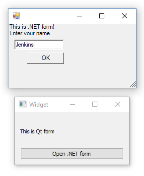

# QtWithDotNet
A minimal Qt application that uses C++/CLI

There are 2 windows in the application. 
Once the application is started, the first form, which is written in Qt, shows up. It contains a button, clicking on which raises the second form, composed by C++ .NET in run-time.

The aim of this tiny project is to create a minimal CMake project mixing Qt and .NET for whom it might be interesting.



## Build

Building requires the Windows platform with Visual Studio, Qt5 (compiled with Visual Studio) and CMake installed.
CMake needs to know where Qt5 resides. Set CMAKE_PREFIX_PATH environment variable to the full path to Qt5. On my machine it is D:\Qt\Qt5.9.3\5.9.3\msvc2017_64. Then `cd` to the directory which you git-cloned the repo into and execute the build command

```sh
> mkdir build && cd build && cmake -G "Visual Studio 15 2017 Win64" .. && cmake --build .
```

Please note that -G option specifies CMake generator which may be missing on your machine.
Once built, build\Debug directory should contain the executable. To run the executable you'll need to get Qt5Cored.dll, Qt5Guid.dll and Qt5Widgetsd.dll in the directory. Copy them from your installed Qt5.
